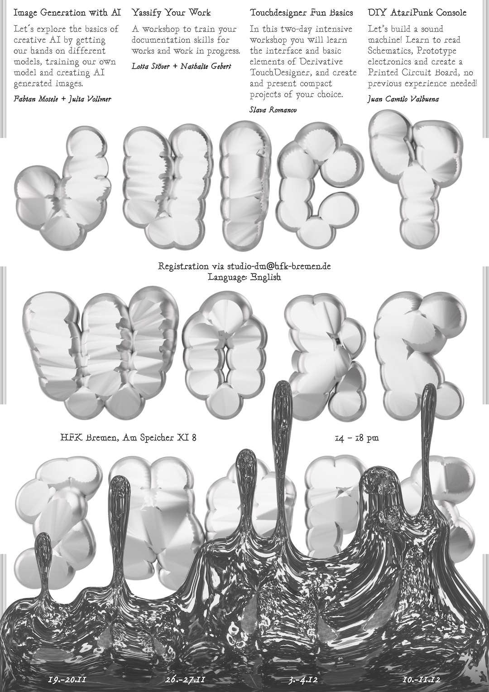

# Digital Media Juicy Workshops 2.0

We are happy to inform you that once again in November and December 2022 we will offer a sequence of 4 Juicy Workshops ministered by digital media students for Digital Media students (both bachelor/master and uni/hfk):

## [19.11-20.11] Image Generation with AI, by Fabian Mosele + Julia Vollmer

What are image generative machine learning models and how can one use them? In this two-day workshop you will get to know the basics of creative AI in the realm of image generation, from how different models work (GAN vs Diffusion models), their history and the ethical debates around this topic. With this in mind, we will get our hands on different models, train our own model and create AI generated images.

### Requirements:

Laptop, google drive (at least 6GB free if possible), a plus if you have multiple Google accounts, some general knowledge of programming would make the second day easier

## [26.11-27.11] Yassify Your Work, by Lotta Stöver + Nathalie Gebert

We want to improve our documentation skills to make our works look nice on the internet. Finished works as well as works in progress. We'll have a look at various documentation styles, train making a documentation video, we will give a rough breakdown on post-processing techniques (white balance in video *shudder*), and we also prepare a portable DIY-lighting kit for you to make nicely-illuminated photos of your work in progress on the go. (And perhaps we'll have a documentation video movie night, if enough ppl are up to it.)

### Requirements:

Any (fun) object you want to train documenting with, software for (more or less professional) video and photo editing, your camera (smartphone camera works too), camera tripod, and so on.

## [03.11–04.12] Touchdesigner Fun Basics, by Slava Romanov

Welcome to the world of visual programming! In this two-day intensive workshop you will learn the interface and basic elements of Derivative TouchDesigner, and create and present compact projects of your choice. On the eve of the workshop, you will have to fill out a short questionnaire - tell about your background and choose a mini-project for your interest - generative graphics, sensors, sound and other interesting things. Come if you're ready to have a fun time and discover a new tool (or learn more about it)!

Requirements:

Laptop - Windows or Mac (at least 8GB memory, discrete graphics best but not obligatory) Installed TouchDesigner 2022/26590 or newer (https://derivative.ca/download/archive), the free version is okay.

## [10.11-11.12] DIY AtariPunk Console, by Juan Camilo Valbuena

Hello, my name is Juan and I want to show you how I build electronic stuff. This time I would like to build a sound oscillator with you. The Ataripunk Console, first designed by Forrest Mims, is a very popular beginner level electronics project. The circuit is a simple square wave oscillator using two 555 timers (what the hell is a 555 timer?). We will learn how to read schematics, get basic understanding of sound waves, prototype a circuit, design a printed circuit board (PCB), solder, and design a house for the instrument. No previous experience required!

### Requirements:

No previous knowledge is needed.

------------------

Language: English

Where: at Hfk Speicher XI - Room number will be announced on the week before each workshop.

Time: Always on Saturdays & Sundays, 14:00h-18:00h.

Max Participants: 15 per workshop. All students, Bachelor, Master, Uni or HfK are welcome to apply.

Registration: register via studio-dm@hfk-bremen.de with desired workshop.

Organizers: Julia Vollmer, Alberto Harres

Poster: Lucy Savelyeva

Stay tuned! More detailed information will be sent to all participants one week before the workshop.

Any questions or doubts feel free to contact us at studio-dm@hfk-bremen.de, aharres@hfk-bremen.de or jvollmer@hfk-bremen.de
